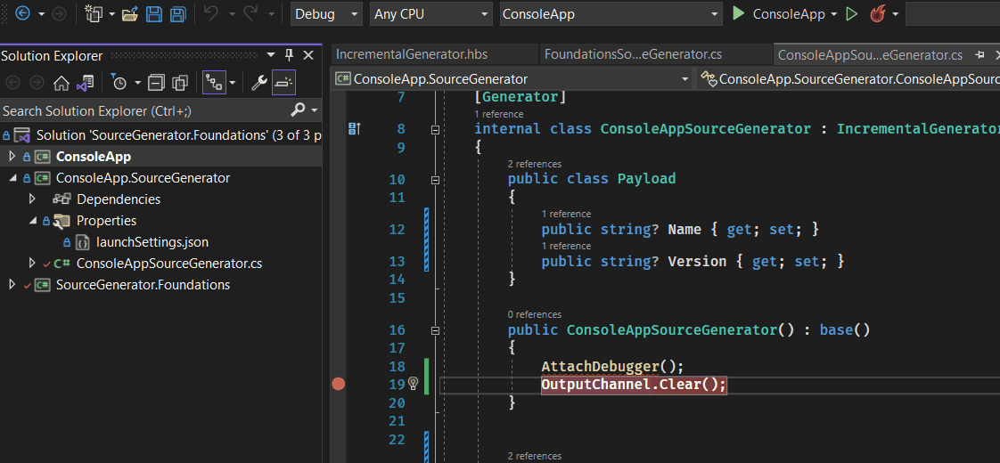

# SourceGenerator.Foudations

Source Generators are awesome but working with them can be a bit painful. This library is designed to try to smooth out some of the following bumps.


## Nuget Nightmares

Source generators run in a unique place and their references don't act the same. If you have a source generator that attempts to reference a NuGet package it will fail to be found at runtime. The reason is the source generators need to have their dll's alongside the running process but that also means that the project the generator is running aginst will to. If you look online the best option is to do this:

```xml
<ItemGroup>
    <PackageReference Include="Newtonsoft.Json" Version="13.0.1" GeneratePathProperty="true" PrivateAssets="all" />
</ItemGroup>
<ItemGroup>
    <EmbeddedResource Include="$(PKGNewtonsoft_Json)\lib\netstandard2.0\Newtonsoft.Json.dll" Visible="false" />
</ItemGroup>
```
This MSBuild logic adds a reference to `Newtonsoft.Json` version `13.0.1` and sets a few attributes. Using `GeneratePathProperty="true"` will emit the variable `PKGNewtonsoft_Json` which points at the root of the NuGet package on dis. Using `EmbeddedResource` we then give the full path to the dll. When the project is compiled the dlls will be embeded as a resource.

This works well but requires a lot of boilerplate. Even worse is this is just for one package. You would need to repeat this for every dependency and any transitive ones as well. This gets out of hand very fast.


*Source.Generator foundations automates this all for you. Just add your NuGet references and nothing else*

## Logging 
Source generator run in the background and it can be very hard to debug. If you want to make a log you have to write the files to disk and open to read them. 

With this library we leverage the existing Output window and create an entry for each source generator. This is all done by using some Visaul Studio api.


## Debugging 

To be able to debug a source generators one of the suggested methods is to add the following.

```cs
static CustomSourceGenerator()
{
    Debugger.Launch();
}
```
This will popup the following window and you have to select your visual studio instance. Instaed with foundations you can just call a single method and break points work from that point on.



# How it works

SourceGenerator.Foundations is a source generator for source generators. It embed addtional code to provide all the features above. 